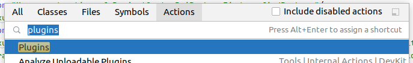
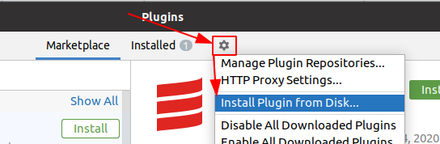

# android-plugin-perf
Diagnostics plugin to measure basic aspects of IJ Android Plugin performance

## Installation
1. Download pre-built archive from here (TODO)
1. `Find Action (Ctrl+Shift+A) > Plugins`

1. Click "gear" button and select "Install Plugin from Disk"

1. Choose zip file
1. Restart IDE if needed

## Additional logging
`Help > Diagnostic Tools > Debug Log Settings`

Extended logging is available for:
1. `com.intellij.psi.ResolveScopeEnlarger` => `#name.kuznetc.ResolveScopeEnlargerLogger`
1. `com.intellij.psi.PsiElementFinder` => `#name.kuznetc.JavaElementFinderLogger`

## Additional actions
### All Android
Adds 'Android facet' to each module in the project.

### (todo)